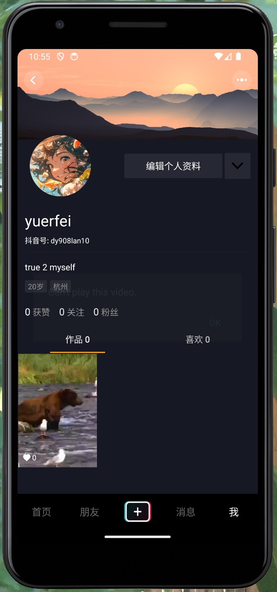
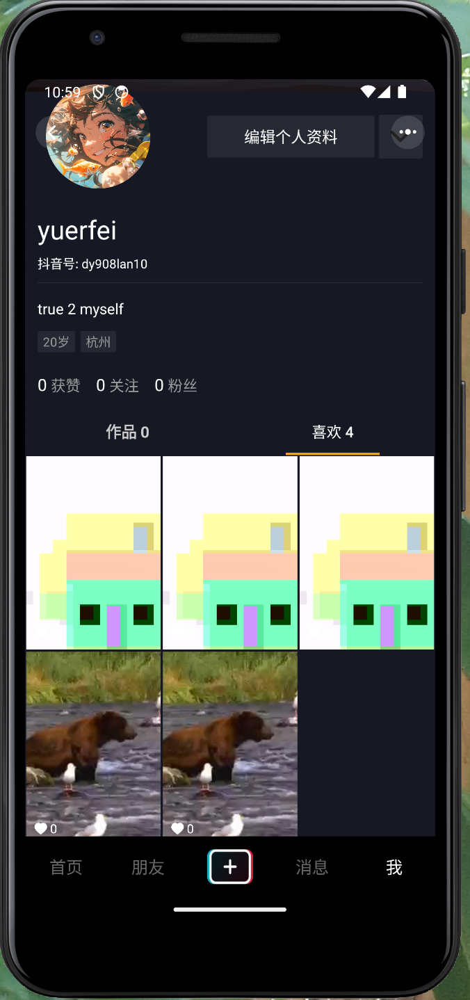
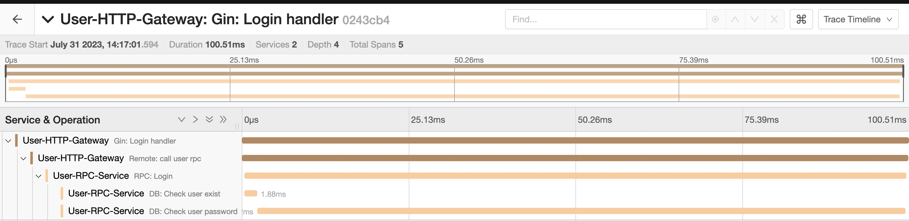
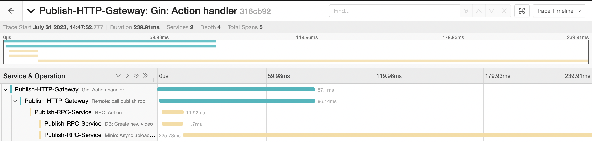

# GoTikTok

基于Gin HTTP + Go-Zero 微服务

**Based on**
- Gin
- Go-Zero
- gRPC
- Gorm
- Go-JWT
- Minio
- Nginx
- Redis
- Mysql
- RabbitMQ
- Jaeger
- Docker

## 架构分层
### 1. HTTP层
使用Gin处理HTTP请求，通过RPC客户端发送给各自的RPC服务端

### 2. RPC层
使用Go-Zero生成RPC服务端脚手架，使用ETCD进行服务注册和服务发现

### 3. DAL层
- 数据库使用MySQL，并使用Gorm对数据库进行ORM操作 
**pack**层将查询结果包装，RPC层可直接调用
- 使用Redis作为缓存，提供自旋锁，基本操作，定时同步等接口

### 4. pkg层
- JWT：JWT的生成和校验
- Auth：用户密码的加密和校验
- Minio：封装Minio对象存储的接口，并使用Nginx对多台Minio服务器进行负载均衡
- Middleware：HTTP中间件
- RabbitMQ: 封装了RabbitMQ的操作接口
- Timer: 简易定时器，用于redis和mysql的定时同步
- Tracer: 封装Jaeger接口，基于OpenTracing对服务进行链路追踪

## 优化
1. 在Publish RPC Servic中，异步进行Minio的视频上传，若上传失败再删除db中的记录，加快对客户端的响应速度 (测试结果：提升接口近一倍的响应速度)
2. 对于可能压力较大的接口(如点赞，关注)， 使用rabiitmq异步处理，并使用redis作为缓存，定时与mysql同步
3. 采用自旋的方式实现简单的redis分布式锁

 
 

## 用户界面

    
    

## 链路追踪

    <h4>Sync Tracing</h4>
    
    <h4>Async Tracing</h4>
    

